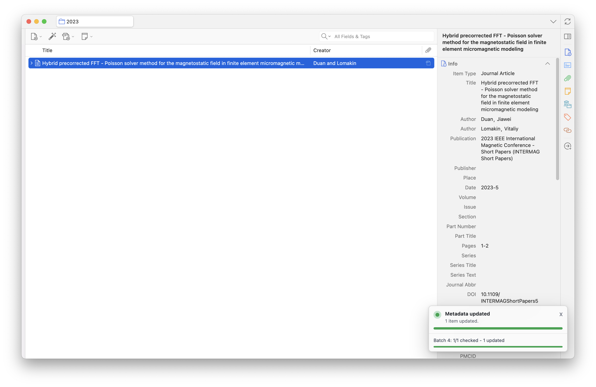
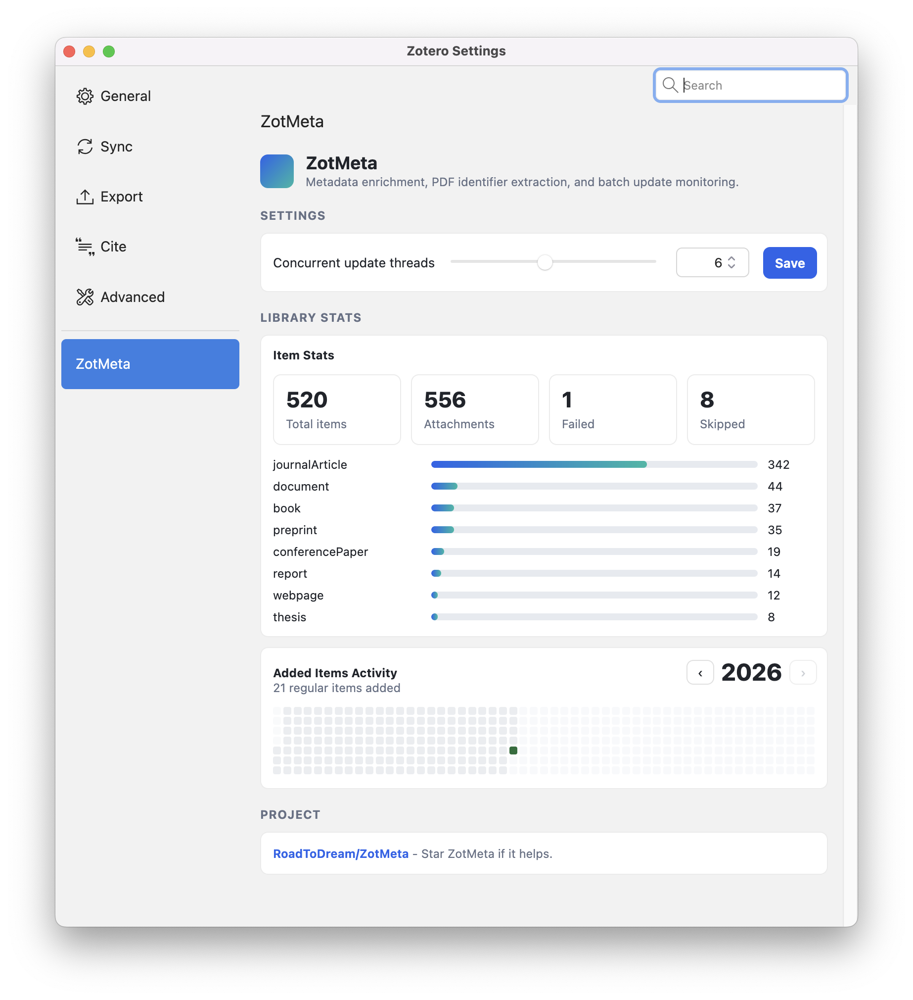

# ZotMeta

ZotMeta is a Zotero plugin for enriching item metadata in bulk. It updates journal articles from DOI metadata, books from ISBN metadata, and arXiv preprints from arXiv IDs. It also includes PDF identifier extraction, batch progress tracking, and a Zotero settings panel for configuration and library stats.

## Features

- Update selected journal article metadata from DOI records, with PubMed as a fallback and configurable lookup order.
- Preserve PMID and PMCID in the Extra field alongside existing notes.
- Update selected book metadata from ISBN records.
- Update arXiv preprints from arXiv identifiers.
- Extract DOI and arXiv identifiers from Zotero's PDF full-text cache when the parent item is missing an identifier.
- Create parent items for selected PDF attachments.
- Run metadata updates in a shared batch queue with configurable concurrency.
- Show one consolidated progress panel for overlapping update batches.
- Optionally tag failed updates with `ZotMeta: Failed` (off by default); skipped items use `ZotMeta: Skipped`.
- View library stats and added-item activity in the ZotMeta settings panel.

## Screenshots

Screenshots can be stored in [`docs/screenshots`](docs/screenshots).

### Progress Panel



### Settings Panel



## Installation

1. Download the latest `.xpi` file from [GitHub Releases](https://github.com/RoadToDream/ZotMeta/releases).
2. In Zotero, open `Tools -> Add-ons`.
3. Click the gear icon and choose `Install Add-on From File...`.
4. Select the downloaded `.xpi` file.
5. Restart Zotero if prompted.

ZotMeta 2.1 declares compatibility with Zotero 7.0 through 10.0.x.

## Usage

### Update Metadata

1. Select one or more Zotero items.
2. Right-click the selection.
3. Choose `Update Metadata`.

ZotMeta will enrich supported items:

- `journalArticle` items use DOI first, with PubMed metadata as a fallback by default.
- `book` items use ISBN metadata.
- arXiv-like preprints use arXiv metadata, with an arXiv DOI fallback if the API fails.

If an item has no DOI or arXiv ID, ZotMeta can try to discover one from the item's PDF full-text cache.

PubMed lookups use the item's DOI, a `PMID: <number>` or `PMCID: PMC<number>` line in Extra,
or a PubMed/PMC article URL. PMID-only and PMCID-only journal items are supported. ZotMeta
checks returned identifiers before applying metadata. Sources are tried in the configured
order until one returns metadata; failed requests and missing matches trigger the fallback.
No title-only matching is performed, and successful results are not merged with the fallback source.
PubMed supplies abstracts and biomedical identifiers as well as citation fields. Existing
fields are retained when the source has no value. PubMed requests share a rate-limited queue
across batch workers. Books and arXiv items continue to use their existing sources.

Books use Open Library's ISBN/edition API, including separate author records. Book requests
share a queue limited to one request per second, and author records are cached for the session.
Titles include subtitles when supplied; missing fields and unresolved authors retain existing values.

arXiv identifiers can also come from a `10.48550/arXiv.<ID>` DOI. arXiv API requests are
queued at one request every three seconds. If the API fails or returns no matching record,
ZotMeta tries the arXiv DOI's metadata. For explicitly versioned identifiers (such as
`2403.18103v1`), the DOI response must report the same version before metadata is applied.

### Create Parent Item

1. Select one or more PDF attachments.
2. Right-click the selection.
3. Choose `Create Parent Item`.

ZotMeta will try to extract DOI or arXiv identifiers from the PDF full-text cache. If an identifier is found, ZotMeta creates and enriches a parent item. If no identifier is found, ZotMeta creates a basic parent item using the PDF title or filename.

### Settings Panel

Open `Tools -> ZotMeta Control Panel`.

The panel includes:

- Concurrent update thread count
- Journal lookup order: `DOI first, PubMed fallback` (default), `PubMed first, DOI fallback`, or `DOI only`
- Tag failed updates (off by default)
- Item stats
- Item type distribution
- Added-item activity by calendar year
- Project link

Click `Save settings` after changing these options. `DOI only` disables PubMed requests.
Previously saved source selections are retained when updating the plugin.

## Update Status Tags

ZotMeta adds tags to make follow-up easier:

- `ZotMeta: Failed` for items where metadata retrieval or saving failed, only when **Tag failed updates** is enabled in settings. This option defaults to off.
- `ZotMeta: Skipped` for unsupported or unchanged items.

Successful updates remove these status tags from the item.
Disabling failure tagging stops new failure tags; it does not clear existing tags.

## Development

Run tests:

```bash
make test
```

Build the XPI:

```bash
make
```

The build artifact is written to `build/zotmeta-<version>.xpi`.

## Release Flow

Zotero checks the `update_url` in `src/manifest.json`, which points to
`https://raw.githubusercontent.com/RoadToDream/ZotMeta/master/updates.json`.
That file supplies the available version, supported Zotero versions, XPI download URL,
and SHA-256 hash. Publishing an XPI alone does not update this manifest.

1. Merge code and version changes.
2. Tag the merged commit on `master`, for example:

```bash
git switch master
git pull --ff-only origin master
git tag v2.1
git push origin v2.1
```

3. The `Release` workflow runs tests, builds the XPI, and generates `updates.json`
   with the SHA-256 hash of that exact XPI. It then publishes the XPI to GitHub Releases.
4. GitHub Actions opens a follow-up PR containing the generated `updates.json`,
   including its release download URL, version, compatibility, and hash.
5. Merge the `updates.json` PR to notify existing users through Zotero's update system.

`make` also generates a hash for local builds. A fresh GitHub Actions build can have
different ZIP bytes, so the release workflow's generated hash must be used for the
published XPI. Do not substitute a local build's hash in the release metadata PR.
Pushing a development branch does not publish a release; pushing a version tag does.

The workflow declares `contents: write` and `pull-requests: write`. In the repository's
**Settings -> Actions -> General -> Workflow permissions**, also enable
**Allow GitHub Actions to create and approve pull requests** so the metadata PR can
be opened. See the [create-pull-request permissions documentation](https://github.com/peter-evans/create-pull-request#workflow-permissions).

## Credits

Special thanks to [make-it-red](https://github.com/zotero/make-it-red/tree/main), which is the base of the add-on.
